<p align="center">
  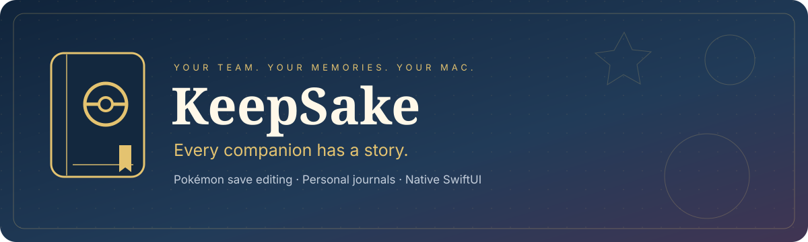
</p>

<p align="center">
  <strong>A home for the Pokémon you keep coming back to.</strong><br />
  A native SwiftUI save editor with personal journals, saved teams, and a little room for nostalgia.
</p>

<p align="center">
  <a href="https://github.com/omgkai/KeepSake/releases/latest"><strong>↓ Download for Mac</strong></a> &nbsp; · &nbsp;
  <a href="#a-look-inside">Take a look</a> &nbsp; · &nbsp;
  <a href="#your-first-adventure">Get started</a> &nbsp; · &nbsp;
  <a href="https://github.com/omgkai/KeepSake/issues">Support</a> &nbsp; · &nbsp;
  <a href="#credits-and-license">Credits</a>
</p>

<p align="center"><sub>macOS 14+ &nbsp; / &nbsp; Apple Silicon + Intel &nbsp; / &nbsp; Apple notarized &nbsp; / &nbsp; GPL-3.0-or-later</sub></p>

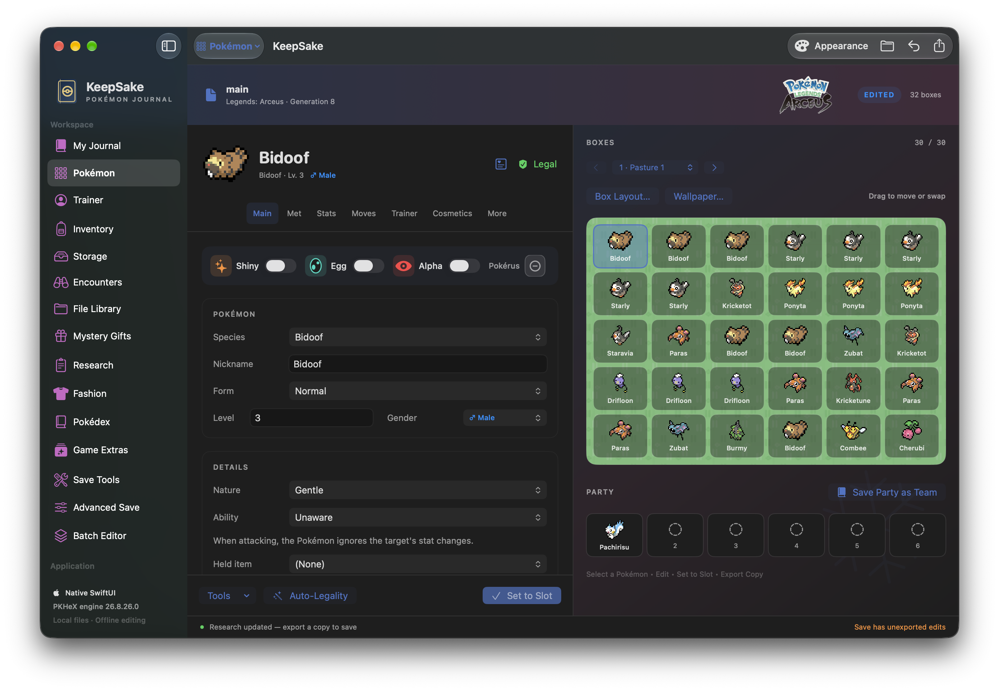

## Made for your adventures

KeepSake brings PKHeX.Core and offline Auto-Legality to a native Mac interface. Edit your collection, find encounters, organize teams, and keep the memories that make those Pokémon yours.

| The editor | The keepsakes | Your Mac |
| :--- | :--- | :--- |
| Pokémon, boxes, stats, moves, trainer details and legality reports. | Companion journals, favorite Pokémon, team pages and custom covers. | Native SwiftUI, independent save windows, drag-and-drop and in-app updates. |
| Inventory, Pokédex, Mystery Gifts and game-specific tools. | Local display names and stories, separate from exported game data. | Game colors, personal presets, pixel sprites and HD portraits. |

## Download

| Your Mac | Choose this release asset |
| :--- | :--- |
| **Apple Silicon** · M-series | `KeepSake-<version>-macOS-arm64.zip` |
| **Intel** | `KeepSake-<version>-macOS-x86_64.zip` |

**[Get the latest signed release →](https://github.com/omgkai/KeepSake/releases/latest)**

Unzip the download and move **KeepSake.app** to **Applications**. Both builds include their runtime; no separate .NET installation is required.

Already using **0.39 or later**? Choose **KeepSake → Check for Updates** to download, verify, install and relaunch. Settings → Updates & Backup offers daily automatic checks and optional automatic download/install on quit. Every open workspace can cancel quitting to protect unsaved edits.

## A look inside

### A journal worth keeping

Give companions their own stories, save your favorite teams, and choose covers that feel like you. Journal names, memories and styles stay in KeepSake without changing Pokémon data.

<table>
<tr><td width="50%">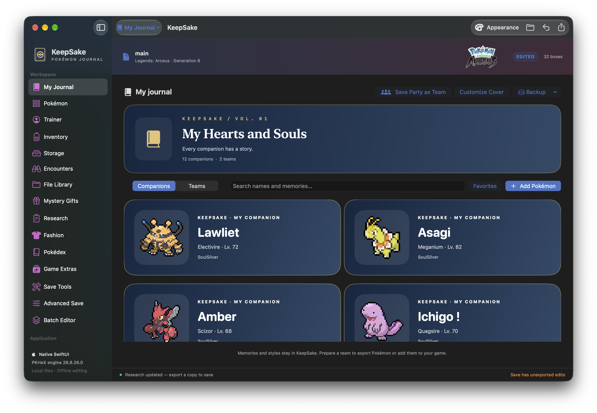<br /><strong>Your companions</strong><br />Names, favorites and memories in one place.</td><td width="50%">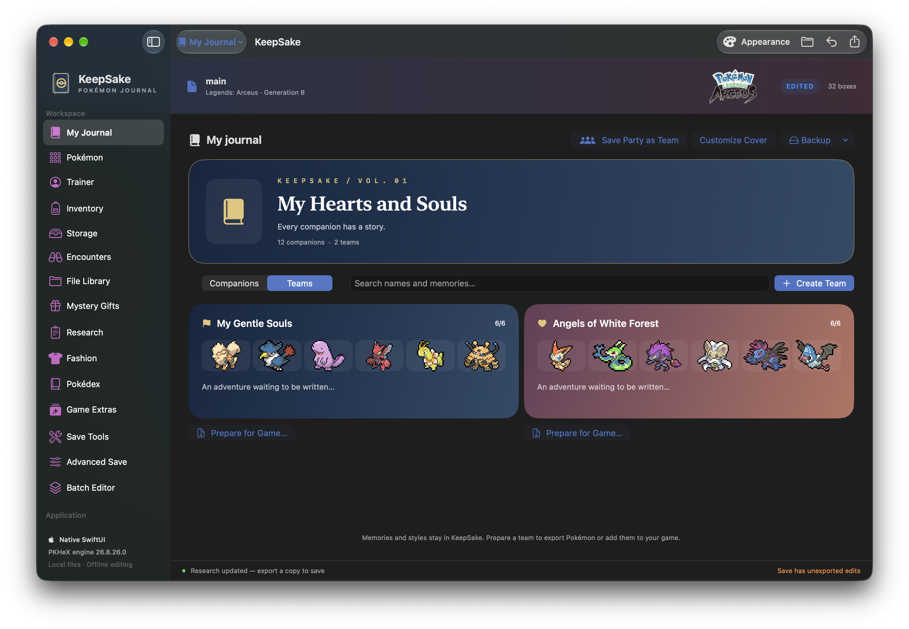<br /><strong>Your teams</strong><br />Keep more than one adventure close.</td></tr>
<tr><td width="50%">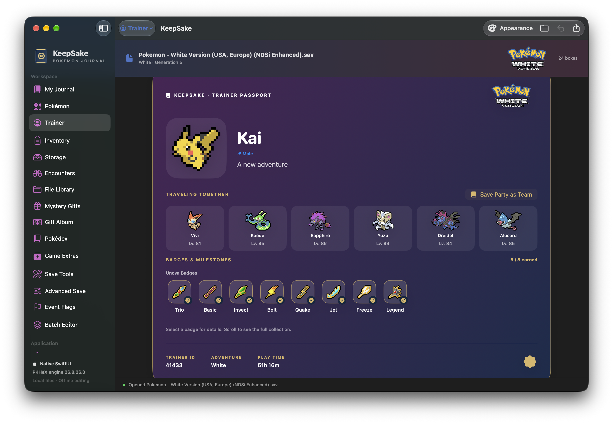<br /><strong>Your trainer passport</strong><br />A team, a region and the badges along the way.</td><td width="50%">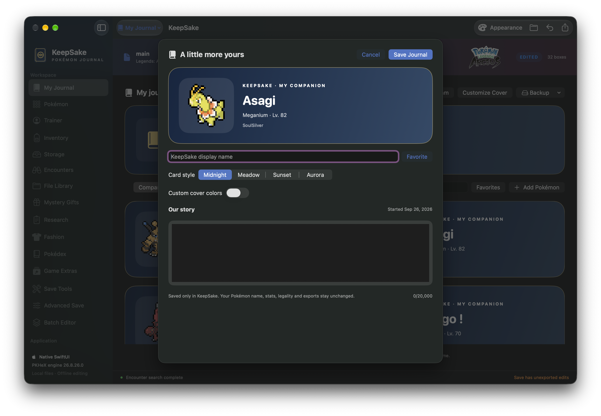<br /><strong>Your own details</strong><br />Custom covers and room to tell their story.</td></tr>
</table>

### The tools behind the adventure

Search encounters and event gifts, inspect stats and legality, and use the tools available for your save’s game. Click a screenshot to see the full-size capture.

<details>
<summary><strong>Stats &amp; legality</strong> — understand your Pokémon</summary>

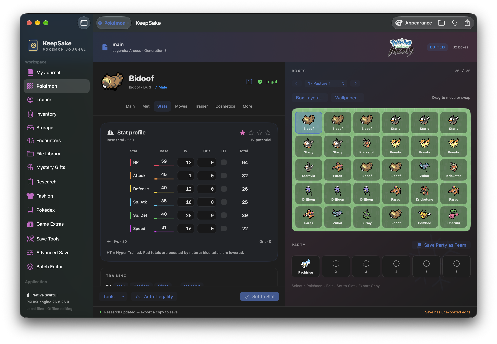
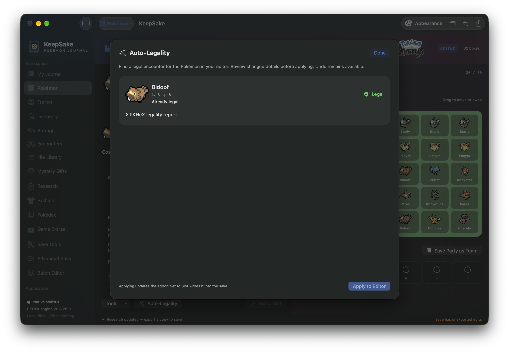
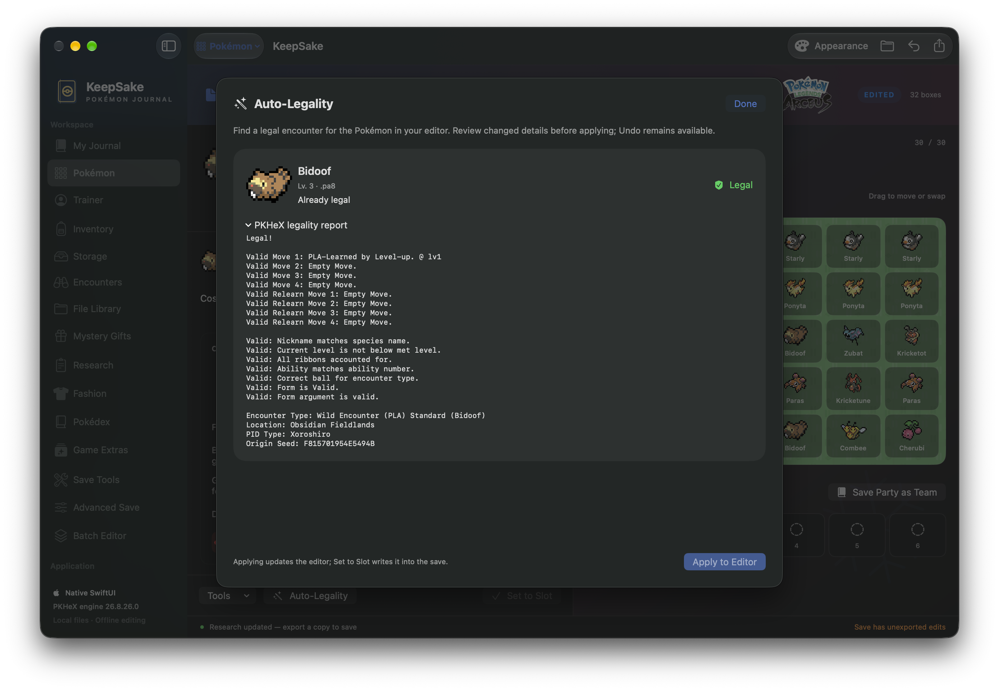

</details>

<details>
<summary><strong>Encounters &amp; Mystery Gifts</strong> — find the next companion</summary>

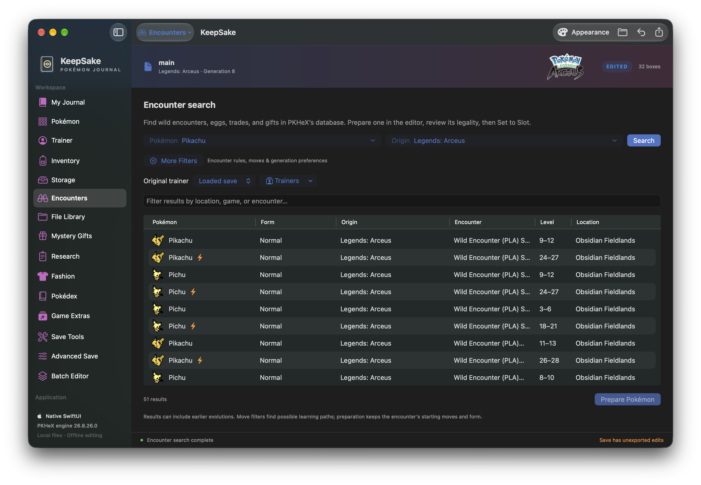
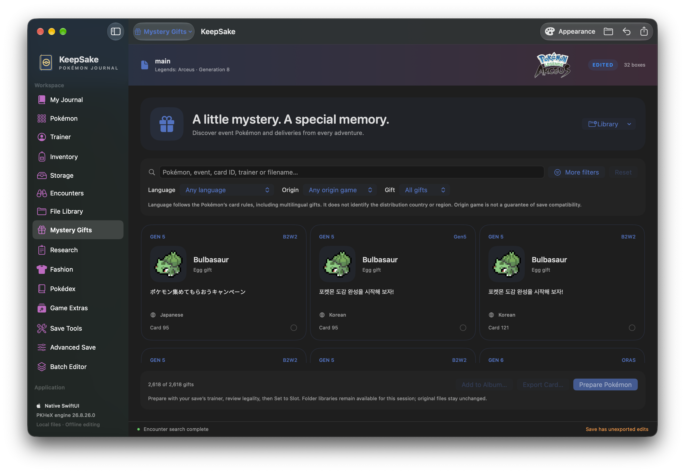

</details>

<details>
<summary><strong>Fashion, Pokédex &amp; save tools</strong> — the rest of your world</summary>

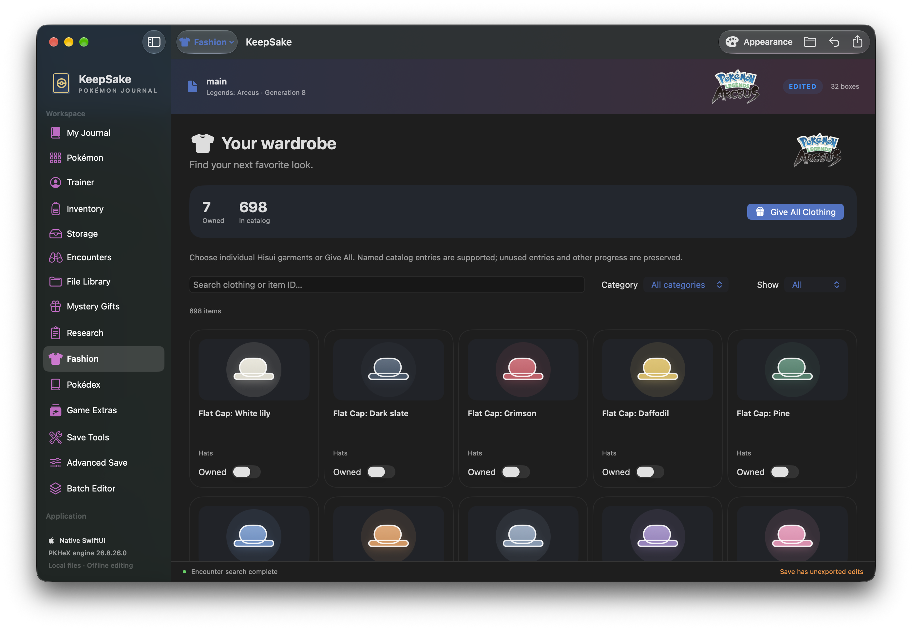
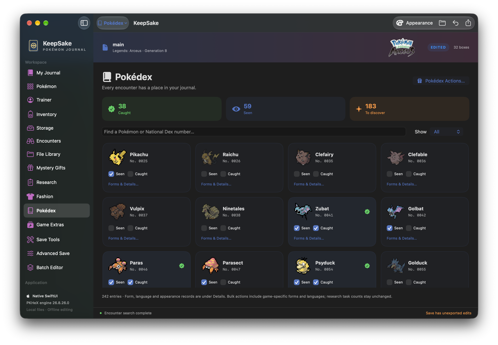
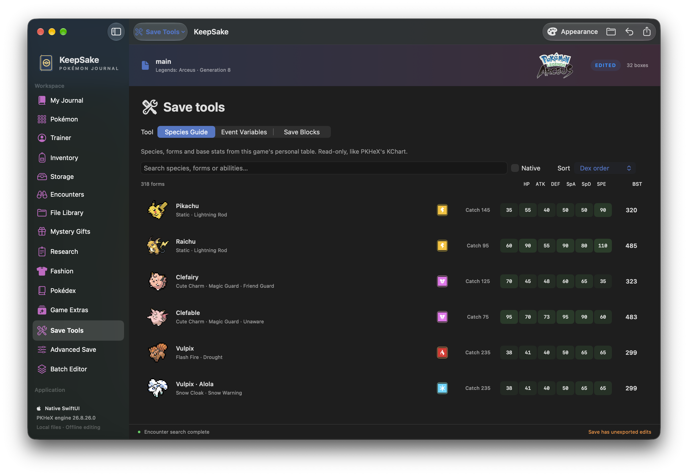

</details>

<sub>Screenshots supplied by Kai White, September 2026. Available controls depend on the loaded save; screenshots may show an earlier interface revision.</sub>

## Your first adventure

1. Open a save or Pokémon file, or drag it into the window. Sample workspaces are also available.
2. Select a Pokémon, make your edits, then **Set to Slot** to keep the edited Pokémon in the save.
3. Choose **Export Copy** to write the edited save while keeping your original file intact.
4. Use **Save Party as Team** to add your current party to the journal, then make the cover and story yours.

Choose **File → New KeepSake Window (⌘N)** for another independent save workspace. Journals and appearance preferences are shared. To move Pokémon between separate save windows, export and open a Pokémon file; direct cross-window Pokémon dragging is not supported.

## Backup and restore

**Settings → Files & Startup** manages original-save backups and save discovery. **Updates & Backup** lets you choose a destination, including a folder in iCloud Drive, and create a dated backup containing journal pages, teams, basic appearance preferences and existing original-save backups.

Cloud transfer is managed by macOS. KeepSake confirms that files were written locally, not that they have finished uploading. Keychain is for credentials, not save storage. Backups do not include unsaved editor changes or arbitrary files elsewhere on your Mac.

To restore your journal, import `Journal.json` from My Journal; entries and teams merge using their modification dates. For a save, copy the appropriate `.bak` file out of `Original Save Backups` and open that copy in KeepSake. `RESTORE.txt` accompanies each backup. `Appearance.plist` records basic preferences for reference; it is not automatically imported.

## Help

Choose **Help → KeepSake Support** for backup tools, update checks and a link to [Issues](https://github.com/omgkai/KeepSake/issues). Copy App Details includes only the app version, macOS version and architecture. Avoid posting personal saves or trainer details in public reports.

## Build

Requires Swift 6 tooling, the macOS SDK and .NET SDK 10.

```sh
KEEPSAKE_ARCH=arm64 KEEPSAKE_APP_PATH="$PWD/KeepSake-AppleSilicon.app" bash build.sh
KEEPSAKE_ARCH=x86_64 KEEPSAKE_APP_PATH="$PWD/KeepSake-Intel.app" bash build.sh
```

Use distinct output paths. The build script writes app bundles and applies a local ad-hoc signature. [SIGNING.md](SIGNING.md) explains Developer ID signing and notarization; credentials belong in Keychain. [FEATURE-COVERAGE.md](FEATURE-COVERAGE.md) documents implementation coverage and native differences. Windows UI layout equivalence, LiveHeX and Windows plugins are outside this release's scope. Settings includes all ten PKHeX interface languages, independently of the game-data catalog language. Common editor labels and navigation reuse PKHeX translations; untranslated specialized tools and guidance fall back to English.

## Credits and license

Made with love by **Kai White**.

- **PKHeX:** [Kaphotics and contributors](https://github.com/kwsch/PKHeX).
- **Auto-Legality Mod:** [Archit Date (architdate)](https://github.com/architdate/PKHeX-Plugins), Kaphotics and contributors; bundled [santacrab2 fork](https://github.com/santacrab2/PKHeX-Plugins), MIT license.
- **Legends: Arceus and Scarlet/Violet item sprites:** **lichen**, via [Arceus collection](https://eeveeexpo.com/resources/1287/) and [Scarlet/Violet collection](https://eeveeexpo.com/resources/1288/).
- **Paldea badges:** **ProfessorMorDBG**, [Paldea Badges demake large](https://www.deviantart.com/professormordbg/art/Paldea-Badges-demake-large-1142694862).
- **Gen 1–6 badges:** **JcFerggy**, [16x16 Pokémon Badge Sprites](https://www.deviantart.com/jcferggy/art/16x16-Pokemon-Badge-Sprites-Gen-1-6-544204402).
- **Gen 9 icon sprites:** **Ezerart**, [normal](https://www.deviantart.com/ezerart/art/Pokemon-Gen-9-Icon-sprites-3DS-Style-944211258) and [shiny](https://www.deviantart.com/ezerart/art/Shiny-Pokemon-Gen-9-Icon-sprites-3DS-Style-944778082).
- **Portrait collections:** PKHeX contributors and [PokeAPI/sprites](https://github.com/PokeAPI/sprites); Pokémon artwork belongs to its respective rights holders.
- **In-app updates:** [Sparkle contributors](https://github.com/sparkle-project/Sparkle), MIT license.

 KeepSake is an unofficial project distributed under GPL-3.0-or-later; see [LICENSE](LICENSE) and [THIRD-PARTY-NOTICES.md](THIRD-PARTY-NOTICES.md). Pokémon and artwork belong to their respective owners. The source license does not relicense separate artwork.
